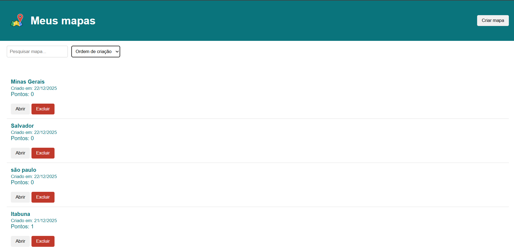
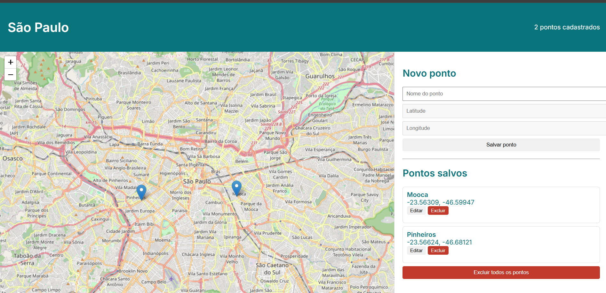

# Meus Mapas

Aplicação web para criação e gerenciamento de mapas personalizados, permitindo adicionar, editar e excluir pontos geográficos interativos utilizando mapas do OpenStreetMap.

O projeto foi desenvolvido como teste técnico, com foco em organização de código, arquitetura simples e experiência do usuário.

---

##  Acesso ao projeto

- **Frontend (Vercel):** https://projeto-frontend-ten.vercel.app/  
- **Backend (Render):** https://projeto-backend-ufwn.onrender.com

##  Telas da Aplicação

### Tela 1 — Lista de Mapas

### Tela 2 — Mapa Interativo

##  Fluxo da Aplicação

1. O usuário acessa a aplicação pelo link de deploy
2. Na tela inicial, visualiza a lista de mapas cadastrados
3. Ao clicar em **Criar Mapa**, um modal é exibido para inserir o nome do estado/País/ Munincípio e etc..
4. Após a criação, o usuário é redirecionado para a tela do mapa detalhado
5. No mapa detalhado:
   - É possível adicionar pontos clicando diretamente no mapa
   - Os pontos podem ser editados ou excluídos individualmente
   - Existe a opção de excluir todos os pontos do mapa
6. Ao voltar para a tela 1 atualize a página para mostrar o novo mapa cadastrado.
---

## Funcionalidades

###  Tela 1 — Lista de Mapas
- Criar novos mapas
- Listar mapas cadastrados
- Buscar mapas por nome
- Ordenar mapas por:
  - Ordem de criação
  - Ordem alfabética
- Excluir mapas
- Visualizar quantidade de pontos por mapa

###  Tela 2 — Mapa Detalhado
- Visualização do mapa com **Leaflet + OpenStreetMap**
- Criar pontos clicando no mapa
- Listar pontos salvos
- Editar nome dos pontos
- Excluir pontos individualmente
- Excluir todos os pontos de um mapa

---

##  Tecnologias Utilizadas

### Frontend
- HTML5
- CSS3
- JavaScript 
- Leaflet.js
- OpenStreetMap
- Deploy: **Vercel**

### Backend
- Node.js
- Express
- SQLite
- CORS
- Deploy: **Render**

---

##  Estrutura do Projeto

### Raiz do projeto 
- README.md 
- screenshots

### Frontend
- index.html
- map.html
- style.css
- script.js
- map.js
- logo.png

### Backend
- server.js
- database/
-   db.js
- database.db
- package-lock.json
- package.json
- .gitignore

# Link para o repositório do backend 
 Acesso: https://github.com/codebyviana/projeto-backend

